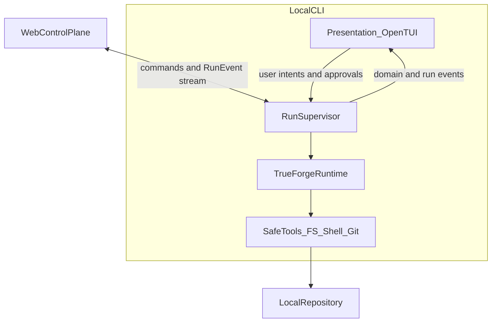

# Clan Code Architecture

**Status:** Stable architecture contract  
**Scope:** Entire repository  
**Change policy:** Update this document only when a fundamental system boundary, trust boundary, or execution model changes. Normal features should fit inside this architecture without rewriting it.

## 1. Product in One Sentence

Clan Code is a local-first AI coding harness where a web control plane lets users assign work to AI agents, while a paired local CLI uses TrueForge to safely inspect, modify, test, and propose changes to real repositories through pull requests.

The game-like "clan/island" interface is a visualization of software work. It must never become the source of truth for execution.

## 2. Core Architectural Principles

These are non-negotiable.

**Local execution by default**  
Repository files, shell commands, builds, and tests execute on the user's machine through the CLI, not inside the hosted web application.

**Web = control plane, CLI = execution plane**  
The web app coordinates intent, state, visualization, and approvals. The CLI owns filesystem and process access.

**TrueForge is the agent runtime**  
Model reasoning, tool use, execution policies, and agent orchestration must flow through TrueForge rather than a parallel custom agent loop.

**Human approval before risky actions**  
Destructive, irreversible, privileged, or externally visible operations require an explicit approval gate.

**Pull-request-first delivery**  
Agents work on isolated branches/worktrees. Production code changes are proposed through GitHub pull requests, reviewed by Qodo, and merged by a human.

**Least privilege everywhere**  
Every agent, tool, token, filesystem path, command, and integration gets only the minimum access required.

**Provider-agnostic models**  
Model providers are adapters. Product behavior must not depend on one LLM vendor.

**Observable and resumable runs**  
Important agent actions are emitted as structured events so the UI can show what happened and runs can fail safely.

**No silent autonomy**  
The user should always be able to understand what an agent is doing, what it changed, what it wants permission to do, and what the result was.

**Security beats convenience**  
Never weaken sandboxing, permission checks, approval gates, or secret handling to make a demo easier.

## 3. System Overview

```
┌─────────────────────────────────────────────────────────────────────┐
│                        Hosted Web App                               │
│                        Next.js / Vercel                             │
│                                                                     │
│  Auth ─ Repo Selection ─ Clan UI ─ Task Composer ─ Run Timeline     │
│    │         │              │            │              │           │
│    │         │              │            └─ Approval UI  │           │
│    │         │              │                          │           │
│    └─────────┴──────────────┴──── Control/API Layer ──────┐         │
└───────────────────────────────────────────────────────────┼─────────┘
                                                            │
                              authenticated, paired,        │
                              bidirectional channel         │
                                                            │
┌───────────────────────────────────────────────────────────▼─────────┐
│                           Local CLI                                 │
│                                                                     │
│  Device Pairing ─ Repo Resolver ─ Policy Engine ─ Run Supervisor    │
│         │                                                         │
│         ▼                                                         │
│                    TrueForge Runtime                                │
│         │                                                         │
│    ┌────┼────────────────────┼───────────────────┐                  │
│    ▼    ▼                    ▼                   ▼                  │
│ Model  Adapter          Safe Tools          Agent Memory              │
│         │                    │                   │                  │
│         │              FS / Shell / Git          │                  │
│         │                    │                   │                  │
│         └────────────────────┼───────────────────┘                  │
│                              ▼                                      │
│                     Local Repository                                │
│              branch / worktree / tests                              │
└──────────────────────────────┬──────────────────────────────────────┘
                               │
                               ▼
                          GitHub PR
                               │
                               ▼
                         Qodo Review
                               │
                               ▼
                          Human Merge
```

## 4. Repository Ownership

The repository is intentionally split by responsibility.

```
/
├── app/                         # Next.js application routes and UI
├── public/                      # Web-only static visualization assets
│   ├── assets/
│   │   ├── kenney_fantasy-town-kit_2.0/
│   │   ├── kenney_nature-kit/
│   │   ├── kenney_pirate-kit/
│   │   └── kenney_survival-kit/
│   ├── audio/                  # Theme music and interaction SFX
│   └── fonts/                  # Clash Display HUD/branding fonts
├── memory/                      # Project-local durable context and catalogs
│   ├── memory.md
│   └── visualization-assets.md  # Kenney/font/audio inventory
├── clan-cli/                    # Independent nested Bun workspace
│   ├── packages/
│   │   ├── cli/                 # @clancode/cli: local execution + TUI
│   │   │   └── src/
│   │   │       ├── main.tsx     # CLI bootstrap
│   │   │       ├── app/         # TUI composition
│   │   │       ├── components/  # Presentation-only TUI components
│   │   │       └── commands/    # Thin command routing
│   │   └── protocol/            # Planned shared RunEvent contracts
│   ├── package.json             # CLI workspace manifest
│   ├── bun.lock                 # CLI workspace lockfile
│   └── tsconfig.base.json       # CLI workspace TypeScript config
├── AGENTS.md                    # Rules for development AI agents
├── ARCHITECTURE.md              # This architecture contract
├── package.json                 # Next.js web application package
├── bun.lock                     # Web application lockfile
└── tsconfig.json
```

The web application and `clan-cli` are currently separate Bun package roots with
separate dependency installation and lockfile boundaries. The root package does
not implicitly own or execute the nested CLI workspace.
The root TypeScript project also excludes `clan-cli`; the nested package owns
its own TypeScript configuration and validation.

The `public/assets/`, `public/audio/`, and `public/fonts/` trees belong to the
Next.js web visualization layer. They are not CLI dependencies and must not be
copied into `clan-cli/`. The canonical inventory and kit-to-domain mapping live
in [`memory/visualization-assets.md`](memory/visualization-assets.md), rather
than in this stable contract.

### 4.1. Package and Workspace Naming

- Product brand: **ClanCode**.
- Web application package: `clancode`.
- CLI package scope: `@clancode/*`.
- Local CLI package: `@clancode/cli`.
- Published CLI binary: **`clancode`** (`npm install -g @clancode/cli`).
- `packages/protocol` is the planned home for dependency-light contracts shared by
  the web application and CLI. It must not import either implementation.

**Boundary rule**

- Code that needs browser/UI concerns belongs in the web application.
- Code that needs filesystem, shell, Git, local credentials, or repository execution belongs in the CLI.
- Shared data contracts should be dependency-light and must never import web or CLI implementation code.
- The nested CLI workspace must not be treated as a second web application or a
  reason to duplicate control-plane responsibilities.
- Do not move local execution into server routes or server actions.

## 5. Web Control Plane

The web application is responsible for:

- user authentication;
- GitHub connection and repository selection;
- rendering repositories as clans/islands;
- creating and displaying coding tasks;
- selecting/configuring agents and models;
- receiving structured run events;
- displaying agent progress, tool activity, diffs, test results, and errors;
- presenting approval requests;
- displaying resulting branches and pull requests;
- storing non-sensitive product metadata.

The web application is **not** responsible for:

- directly reading arbitrary local files;
- executing repository commands;
- holding local filesystem permissions;
- executing untrusted generated code;
- silently approving sensitive operations;
- becoming a second agent runtime.

## 6. Local CLI Execution Plane

The CLI is the trusted bridge between Clan Code and the user's machine.

Its responsibilities are:

- Pair the local device with an authenticated web session.
- Resolve and validate the selected repository.
- Establish an isolated execution context for the task.
- Start and supervise a TrueForge run.
- Enforce tool and command policy.
- Execute allowed filesystem, shell, test, build, Git, and repository tools.
- Pause when an operation needs human approval.
- Stream structured events back to the control plane.
- Produce a reviewable diff.
- Create a branch/commit/pull request only after the required approval.
- Fail closed and clean up safely when a run terminates.

**CLI invariants**

- Never execute outside the approved repository/worktree.
- Never expose secrets in prompts, logs, telemetry, or UI events.
- Never execute an irreversible command merely because a model requested it.
- Never push directly to the protected/default branch.
- Never merge a pull request automatically.

### 6.1. CLI Internal Layers

The local CLI has a presentation layer and an execution layer. They communicate
through explicit domain state and structured events; the presentation layer is
never an authorization boundary.



- **Presentation (`OpenTUI`/React):** Renders status, approvals, and run
  timelines from domain state and events. It may submit user intents, but it
  cannot authorize tools, mutate Git state, or decide whether a run succeeded.
- **Run supervisor:** Owns device pairing, repository resolution, run lifecycle,
  policy evaluation, cancellation, approval coordination, and event emission.
- **TrueForge runtime:** Owns the runtime agent loop and receives typed context,
  tools, policy, limits, and event sinks through a thin adapter.
- **Safe tools:** Implement filesystem, process, test, build, and Git operations
  behind repository boundaries and risk classification.

`OpenTUI` is the CLI presentation stack, analogous to the web application's
Next.js presentation stack. Replacing the TUI library must not move execution,
policy, or repository access into UI components. The volatile implementation
baseline for these layers is maintained in [`memory/memory.md`](memory/memory.md).

## 7. TrueForge Runtime Boundary

TrueForge is the execution harness for runtime agents.

Clan Code may provide:

- task/context input;
- model selection;
- tool definitions;
- permission policy;
- approval callbacks;
- event sinks;
- execution limits;
- run metadata.

TrueForge owns the runtime agent loop.

- Do not implement a competing hidden agent loop in the web app or CLI.
- Any orchestration built around TrueForge must remain thin, explicit, and replaceable.

## 8. Agent Model

Runtime agents are specialized workers, not unrestricted superusers.

A run may use roles such as:

**Planner**  
Turns the user's goal into an ordered implementation plan.

**Explorer**  
Reads repository structure, symbols, documentation, tests, and relevant history.

**Builder**  
Makes the smallest code changes required by the approved plan.

**Tester**  
Runs focused checks, interprets failures, and verifies expected behavior.

**Reviewer**  
Inspects the final diff for correctness, security, regressions, and unnecessary complexity.

Roles may be combined for small tasks. The architecture does not require a fixed number of agents.

**Rule**  
Capabilities come from tools and policy, not from the agent's name or model.

## 9. Tool Safety Model

Every tool belongs to one of three classes.

### A. Read-only

Examples:

- read file;
- list directory;
- search source;
- inspect Git status/diff;
- read dependency metadata.

These can normally run without approval inside the allowed repository boundary.

### B. Reversible write

Examples:

- edit/create a file in the task worktree;
- run formatter;
- create a local branch;
- install a project dependency when explicitly allowed.

These require policy checks and must remain reviewable.

### C. Sensitive / external / destructive

Examples:

- deleting significant files;
- force operations;
- writing outside the repository;
- modifying credentials;
- pushing commits;
- opening or updating a pull request;
- publishing/deploying;
- invoking privileged system commands;
- operations that may incur meaningful cost.

These require an explicit human approval gate unless a narrowly scoped permission was already granted for the current run.

**Command rules**

- Prefer structured process execution with argument arrays over shell-string concatenation.
- Enforce working-directory boundaries.
- Apply timeouts and output limits.
- Redact secrets.
- Block known-dangerous command patterns unless explicitly approved.
- Treat model-generated command text as untrusted input.

## 10. Isolation Strategy

A coding task should not modify the user's active checkout unpredictably.

Preferred flow:

```
selected repository (dirty checkout allowed)
        ↓
explicit base commit
        ↓
create isolated clancode/* branch + git worktree
        ↓
agent reads + edits inside the worktree only
        ↓
format / lint / test / build
        ↓
review diff
        ↓
approval
        ↓
commit + push (task branch only; never default branch)
        ↓
pull request
```

Clan Code does **not** stash, reset, or clean the user's working directory.
Build mutations happen only in the task worktree. A dirty primary checkout is
supported and must remain unchanged. Failed runs preserve the worktree unless
the user explicitly requests cleanup.

If an isolated worktree cannot be created, the CLI must fail closed rather than
edit the user's active checkout.

## 11. Web ↔ CLI Protocol

The transport may evolve, but the protocol contract should remain stable.

Communication must be:

- authenticated;
- bound to a paired user/device;
- scoped to a specific repository and run;
- bidirectional;
- reconnectable;
- event-oriented;
- safe against replay where applicable.

**Canonical event shape**

```typescript
type RunEvent = {
  version: 1;
  eventId: string;
  sequence: number;
  runId: string;
  timestamp: string;
  type: string;
  payload: unknown;
};
```

`eventId` and `sequence` are additive v1 fields (not a v2 protocol). The website and OpenTUI consume this vocabulary; they must not depend on raw TrueForge event types.

Representative event types:

- `task.accepted`
- `run.started`
- `agent.started`
- `agent.message`
- `tool.requested`
- `tool.started`
- `tool.completed`
- `tool.failed`
- `approval.required`
- `approval.granted`
- `approval.denied`
- `diff.updated`
- `validation.started`
- `validation.completed`
- `pr.created`
- `run.completed`
- `run.failed`
- `run.cancelled`

Events are append-oriented facts. UI animations are derived from events; UI state must not become execution authority.

## 12. State Model

The core product state is intentionally small.

**Repository**  
A GitHub/local repository the user has connected.

**Task**  
The user's requested outcome.

**Run**  
One execution attempt for a task.

**Agent**  
A runtime worker participating in a run.

**Step**  
A meaningful reasoning/tool activity within a run.

**Approval**  
A pending or resolved human decision for a sensitive action.

**Artifact**  
A result such as a diff, test report, commit, branch, or pull request.

Keep these concepts stable even if the database schema changes.

## 13. Persistence Rules

**Hosted persistence may store**

- user/product profile metadata;
- connected repository identifiers;
- clan/island presentation metadata;
- task metadata;
- run status;
- structured non-secret events;
- approval records;
- branch/PR references;
- user preferences.

**Hosted persistence should not store by default**

- local credentials;
- `.env` contents;
- SSH private keys;
- GitHub access tokens in plaintext;
- arbitrary repository files;
- shell environment dumps;
- secrets extracted from code;
- unbounded raw terminal output.

**Context/vector storage**

Repository indexing is an optional adapter, not a core dependency.

If a remote vector store such as Pinecone is used:

- indexing must be explicit;
- secret files and ignored paths must be excluded;
- chunks must be traceable to repository/path/revision;
- the application must remain functional without the vector store;
- sensitive repositories should be able to use local-only context.

## 14. Authentication and Authorization

Separate these concepts:

**User authentication**  
Answers: Who is using Clan Code? The web control plane uses Clerk. `/` is public; `/dashboard` and later control-plane routes require a signed-in user. Clerk identity is not GitHub authorization, device pairing, or runtime tool permission.

**GitHub authorization**  
Answers: Which GitHub resources may Clan Code access?

**Device pairing**  
Answers: Which local CLI instance may receive this user's tasks?

**Runtime authorization**  
Answers: Which tools/actions may this specific agent run perform?

Never treat one layer as automatic permission for another.

## 15. GitHub Delivery Pipeline

All substantive code produced by agents follows:

```
task
  → isolated branch/worktree
  → implementation
  → validation
  → human approval where required
  → commit
  → push
  → pull request
  → Qodo review
  → findings addressed or explicitly dismissed
  → human merge
```

Direct agent writes to the default branch are prohibited.

Qodo is a review gate and evidence source, not a replacement for tests or human ownership.

## 16. Model Provider Layer

Models must be accessed through an adapter boundary.

The rest of the application should depend on capabilities such as:

- generate / reason
- stream
- tool-call support
- context limits
- cost/usage metadata

—not on provider-specific UI or business logic.

This allows OpenRouter or another provider to change without rewriting the execution system.

Model identity can influence the visual avatar shown in the game UI, but visual identity must never grant capabilities.

## 17. Game / Visualization Architecture

The game layer is a view of engineering state.

Examples:

- repository → island/clan;
- module/service → building;
- coding task → quest/job;
- runtime agent → character;
- active work → construction/repair animation;
- successful validation → completed building state;
- pull request → delivery/result object.

**Critical rule**

Visual state is derived from domain state and run events.

Never encode task correctness, permissions, or execution control only inside animation/game components.

### 17.1. Visualization Assets, Motion, and Audio

The current web visualization stack is:

- `three` for the WebGL scene runtime;
- `@react-three/fiber` for declarative React-to-Three composition;
- `@react-three/drei` for Three.js helpers and loaders;
- `gsap` for 3D scene and object timelines;
- `framer-motion` for 2D HUD and interface transitions.

These dependencies belong only to the root Next.js package. The CLI has its own
OpenTUI presentation stack and must not import browser rendering or audio
dependencies.

Kenney models are served from `public/assets/` and loaded through the typed
[`app/lib/visualization/kenney.ts`](app/lib/visualization/kenney.ts) URL
boundary. Runtime scene models use the verified GLB/GLTF-format directories;
`Overview.html`, `Previews/`, OBJ, and FBX files are reference or interchange
material rather than scene sources. The current inventory is maintained in
[`memory/visualization-assets.md`](memory/visualization-assets.md).

Font files under `public/fonts/` may be used only after their redistribution and
deployment license has been verified. Theme music and click/select feedback under `public/audio/` are
reserved for the web HUD and are managed through
[`app/lib/visualization/audio.ts`](app/lib/visualization/audio.ts). The theme
may loop only when browser playback policy permits it, and users must have an
accessible mute/unmute control. Click audio is best-effort feedback and must
not block or change a domain action when playback fails.

The 3D canvas and audio are optional presentation surfaces. Lazy-load the
canvas, provide a useful non-WebGL fallback, and keep core task/run information
usable when rendering or audio is unavailable. GSAP, Framer Motion, React Three
Fiber state, model loading state, and audio mute state must never authorize a
tool, grant approval, declare validation success, or imply that a branch or PR
exists.

Physics is a future optional adapter, not part of the current asset stack.
Physics collisions and simulation state must remain separate from domain/run
state and policy decisions.

## 18. Failure and Cancellation

Every run must have a safe failure path.

On failure or cancellation:

- stop starting new tools;
- terminate active child processes when safe;
- preserve useful logs and diff state;
- mark the run terminally;
- do not perform pending sensitive actions;
- keep the repository recoverable;
- report a clear reason to the UI.

Retries must be explicit. A retry is a new execution attempt, not silent continuation after an unknown failure.

## 19. Security and Privacy Threat Model

Assume all of the following may be hostile or malformed:

- user prompts;
- repository contents;
- README instructions;
- issue/PR text;
- model output;
- generated shell commands;
- package scripts;
- tool output;
- third-party API responses.

Defend against:

- prompt injection from repository content;
- path traversal;
- command injection;
- secret exfiltration;
- accidental credential logging;
- destructive Git operations;
- execution outside the repository;
- unauthorized device/session use;
- replayed approvals;
- dependency/script side effects;
- model attempts to bypass policy.

The policy engine, not the model, is the final authority.

## 20. Observability

A run should be understandable after the fact.

Capture structured metadata for:

- run lifecycle;
- agent lifecycle;
- requested tools;
- approvals;
- command exit codes;
- validation outcomes;
- changed files;
- generated commits/PRs;
- errors and cancellation reasons.

Do not log secrets or entire repository contents merely for observability.

## 21. Deployment Model

**Hosted**  
The Next.js control plane can be deployed to Vercel or an equivalent web platform.

**Local**  
The CLI runs on the user's machine and owns local execution.

**Important consequence**  
The hosted deployment must still function as a control plane even when no CLI is connected. It should show a clear offline/not-paired state rather than attempting remote code execution.

## 22. Dependency Rules

- Use Bun as the JavaScript/TypeScript package manager/runtime where supported by the project.
- Prefer existing dependencies before adding new ones.
- Avoid framework duplication.
- Keep shared contracts lightweight.
- Do not make Docker mandatory for normal local usage.
- Never add a second agent framework beside TrueForge to solve a problem TrueForge already owns.

## 23. Architectural Anti-Goals

Clan Code is **not**:

- a cloud IDE that uploads and executes the whole repository remotely by default;
- an autonomous bot allowed to merge its own changes;
- a thin chat UI over a model;
- a collection of provider-specific agent hacks;
- a game whose visuals are more authoritative than the actual Git state;
- a system where the web server gets unrestricted access to the user's machine.

## 24. Decision Test for New Features

Before adding a feature, ask:

- Does this belong to the control plane or execution plane?
- Does it preserve local-first execution?
- Does it pass through TrueForge if it is agent runtime behavior?
- What capability does the agent gain?
- What is the minimum permission required?
- Does this action need approval?
- What happens if it fails halfway?
- Can the user see and understand the result?
- Can the change still be delivered through a PR?
- Does it preserve the architectural boundaries above?

If a feature cannot answer these clearly, redesign it before implementation.

## 25. Stable Architecture Contract

The following sentence is the shortest version of this document:

> The web app expresses intent and visualizes state; the paired local CLI executes inside an approved repository; TrueForge runs the agents; policy gates their tools; risky actions require a human; and code reaches the default branch only through a reviewed pull request.

That contract should remain true even as models, UI libraries, storage providers, transports, and individual features change.

## 26. Implementation Baseline

This document defines stable system, trust, and execution boundaries; it is not a
feature-by-feature implementation ledger. The current implementation baseline
and other volatile project status belong in
[`memory/memory.md`](memory/memory.md).

Update `ARCHITECTURE.md` only when a fundamental boundary or execution model
changes. Update `memory/memory.md` when implementation milestones change.
